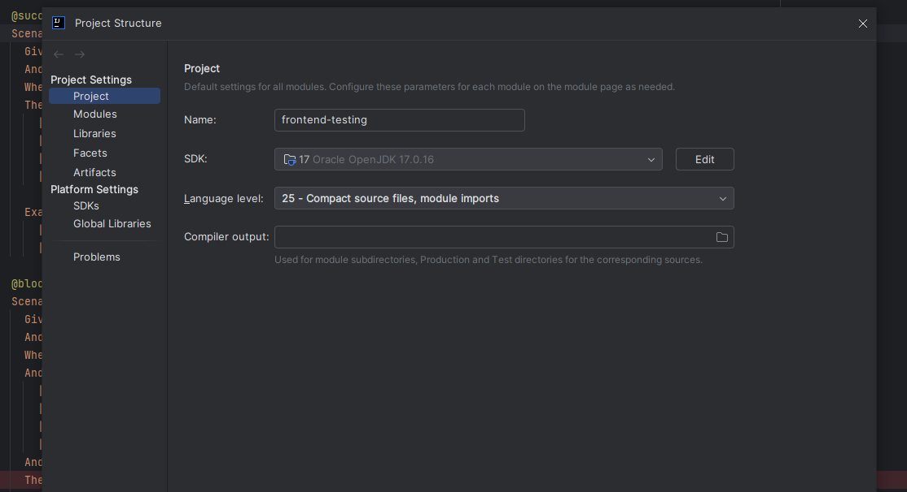
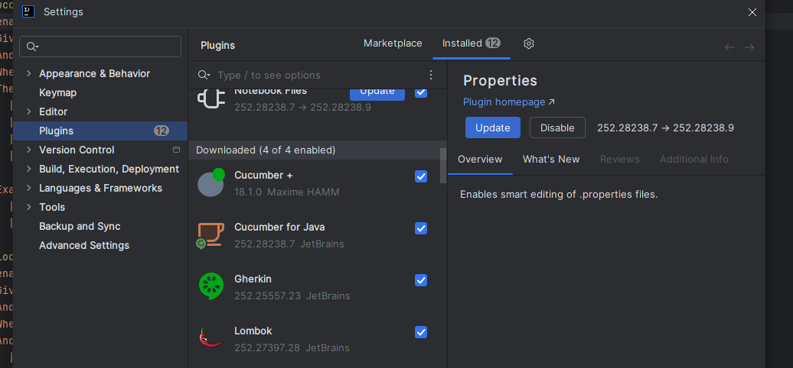
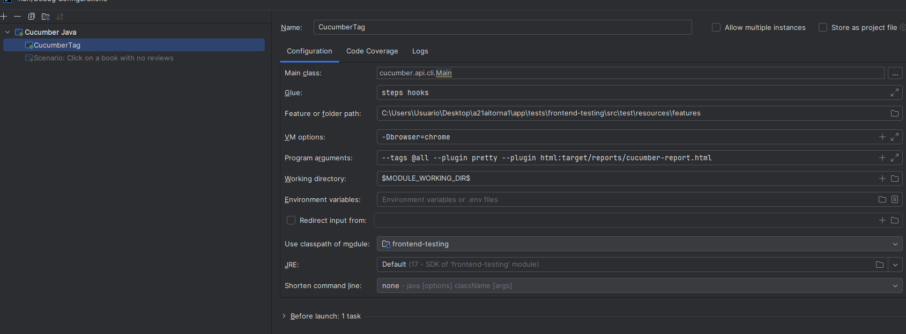

# CÓMO LANZAR LOS TEST CON INTELLIJ

## REQUISITOS
- Java 17
- JDK 17
- Maven 3.9.11

## CONFIGURAR VARIABLES DE ENTORNO EN WINDOWS(saltar si ya esá hecho)
1. Buscar *Editar la varibales de entorno del sistema* y seleccionar *Variables de entorno*.
2. Crear la variable de entorno *JAVA_HOME*.
3. Meter como valor la ruta del JDK de java.
4. Crear la variable de entorno *MVN_HOME*.
5. Meter como valor la ruta a la instalación de Maven.
6. Añadir en *Path*: *%JAVA_HOME%\bin* y *%M2_HOME%\bin* y guardar.
7. Posiblemente se tenga que reiniciar el ordenador.

## INTELLIJ
- En *Project Structure*, en el SDK, seleccionar tu JDK.
    
- En *Settings*, ir a *Plugins* e instalar los siguientes:
  - Cucumber +
  - Cucumber for Java
  - Gherkin
  - Lombok
    
- Reiniciar el IDE.

## LANZAR TESTS
- Lanzar el comando * mvn install -DskipTests* para instalar todo lo del POM.xml
- Configurar el runner (hacer click en la opción de play de la parte superior derecha y seleccionar la opción de Cucumber Java) tal como en la imagen
    