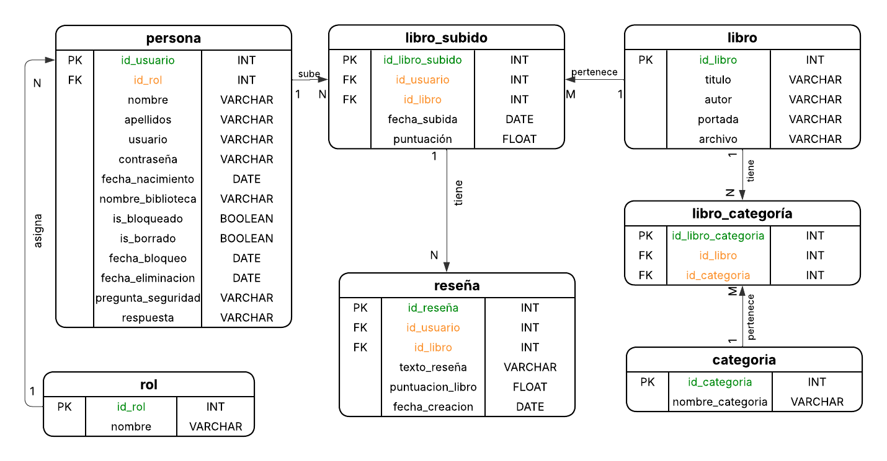
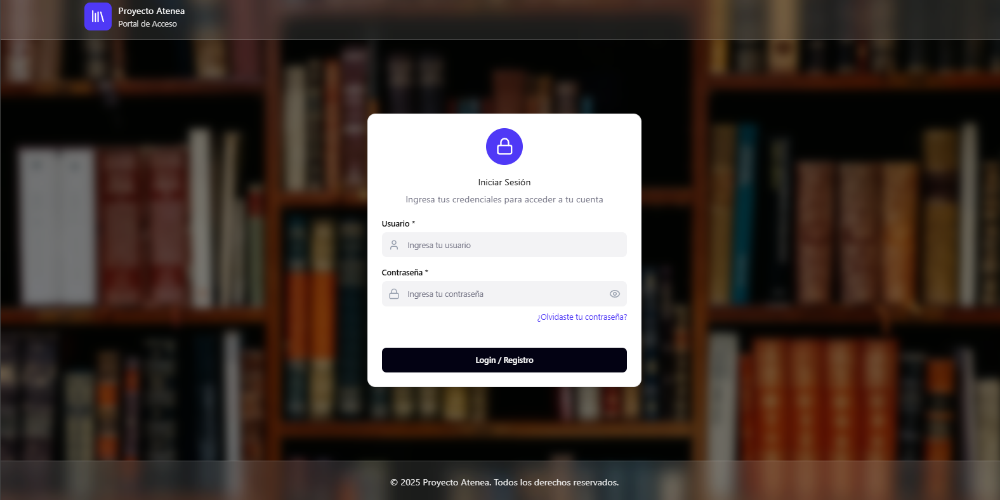
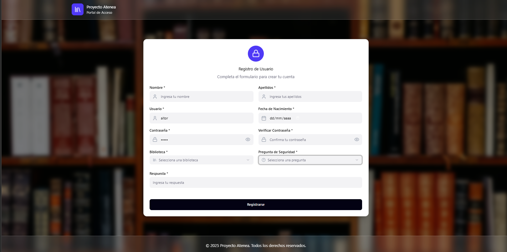
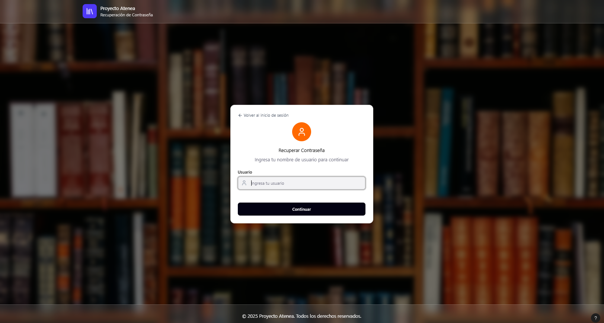
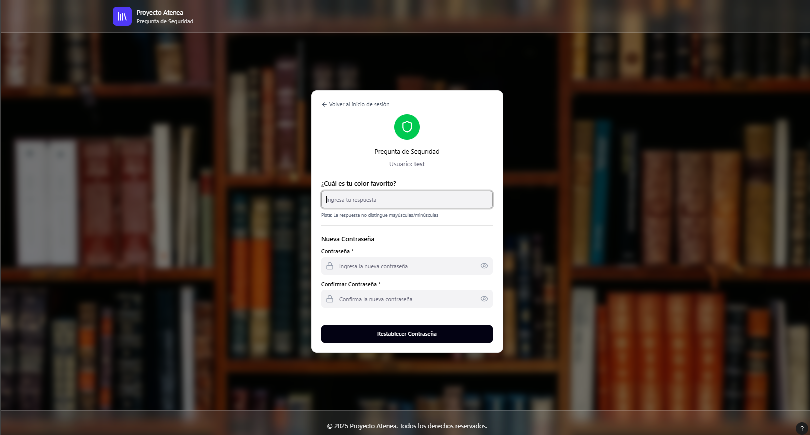
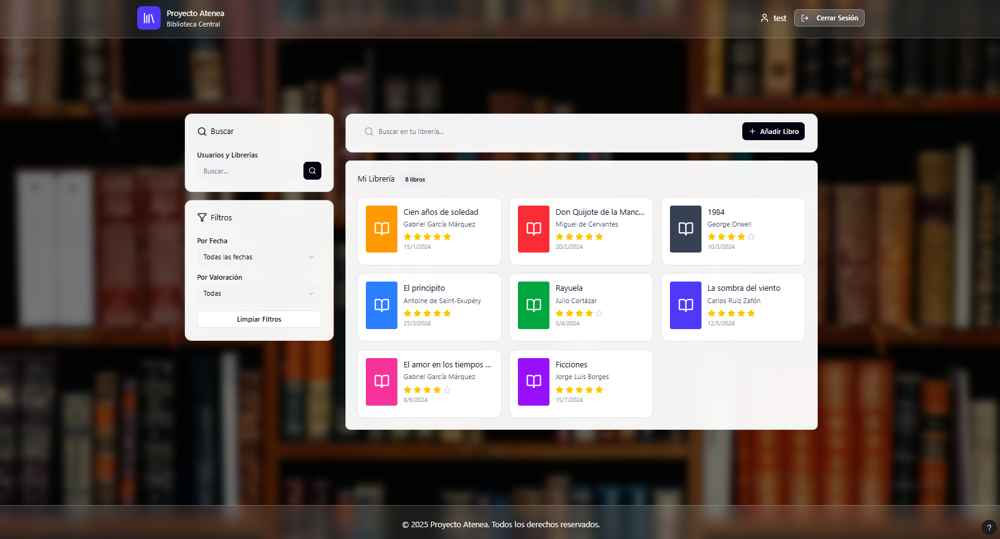
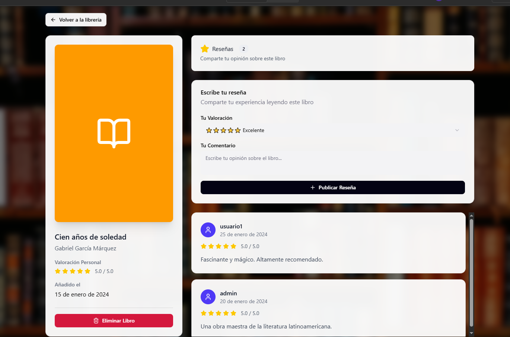
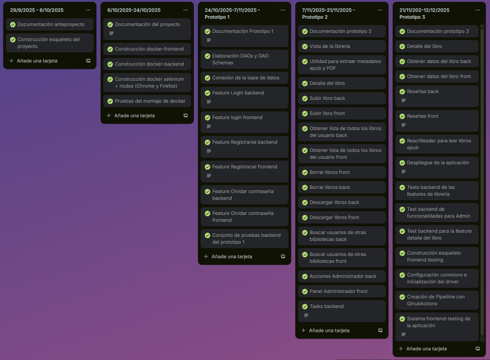

# Proyecto Atenea

- [Introducción](#introducción)
	- [Frontend](#frontend)
	- [Backend](#backend)
	- [Persistencia de datos](#persistencia-de-datos)
	- [Testing](#testing)
		- [Frontend Testing](#frontend-testing)
		- [Backend Testing](#backend-testing)
- [Estado de arte o análisis del contexto](#estado-de-arte-o-análisis-del-contexto)
	- [Público objetivo](#público-objetivo)
	- [Necesidades que cubre](#necesidades-que-cubre)
	- [Aplicaciones existentes](#aplicaciones-existentes)
- [Propósito](#propósito)
- [Objetivos](#objetivos)
	- [Objetivos principales](#objetivos-principales)
	- [Diseño de la aplicación](#diseño-de-la-aplicación)
	- [Sistema de Login](#sistema-de-login)
		- [1.Login](#1login)
		- [2.Registro](#2registro)
		- [3.Recuperar contraseña](#3recuperar-contraseña)
			- [Formulario1 recuperación de contraseña](#formulario1-recuperación-de-contraseña)
			- [Formulario2 recuperación de contraseña](#formulario2-recuperación-de-contraseña)
	- [Sistema de biblioteca](#sistema-de-biblioteca)
		- [1. Buscar otras librerías](#1-buscar-otras-librerías)
		- [2. Buscar libros](#2-buscar-libros)
		- [3. Ordenar libros](#3-ordenar-libros)
		- [4. Subir libros](#4-subir-libros)
		- [5. Biblioteca](#5-biblioteca)
	- [Sistema de detalle del libro](#sistema-de-detalle-del-libro)
		- [1. Detalle](#1-detalle)
		- [2. Contador de reseñas](#2-contador-de-reseñas)
		- [3. Formulario de reseña](#3-formulario-de-reseña)
		- [4. Visualización de reseñas](#4-visualización-de-reseñas)
		- [5. Botón de volver a la librería](#5-botón-de-volver-a-la-librería)
	- [Sistema de admin](#sistema-de-admin)
	- [Backend testing](#backend-testing-1)
		- [1. Login](#1-login)
		- [2. Registro](#2-registro)
		- [3. Recuperar contraseña](#3-recuperar-contraseña)
		- [4. Admin](#4-admin)
		- [5. Book](#5-book)
	- [Frontend testing](#frontend-testing-1)
		- [1. Login](#1-login-1)
		- [2. Registro](#2-registro-1)
		- [3. Recuperar contraseña](#3-recuperar-contraseña-1)
		- [4. Librería](#4-librería)
		- [5. Detalle del libro](#5-detalle-del-libro)
		- [6. Admin](#6-admin)
- [Alcance](#alcance)
	- [Funcionalidades implementadas](#funcionalidades-implementadas)
	- [Usuarios de la aplicación](#usuarios-de-la-aplicación)
	- [Contexto](#contexto)
	- [Límites](#límites)
	- [Planificación](#planificación)
	- [Gastos](#gastos)
	- [Normativa](#normativa)
	- [Ideas de implementación para el futuro](#ideas-de-implementación-para-el-futuro)
- [Despliegues](#despliegues)
	- [1. Frontend](#1-frontend)
	- [2. Backend](#2-backend)
	- [3. Tests](#3-tests)
- [Conclusiones](#conclusiones)
- [Referencias, Fuentes consultadas y Recursos externos: Webgrafía](#referencias-fuentes-consultadas-y-recursos-externos-webgrafía)

## Introducción

Proyecto Atenea es una aplicación web orientada a la gestión de bibliotecas personales digitales. Permite a los usuarios almacenar, visualizar, reseñar y compartir libros en distintos formatos (PDF, EPUB). 
Esta se caracteriza por haber sido diseñada y construida mediante el principio de separación por capas, pudieéndose diferenciar cuatro componentes:
- Frontend: interfaz gráfica y lógica de presentación (React)
- Backend: lógica de negocio, controladores y API REST (Flask).
- Persistencia: gestión de datos mediante MySQL y SQLAlchemy.
- Testing: empleo BDD (Cucumber) y Selenium en Java para pruebas automáticas hacia el front y Newman hacia el back.

Todo esto, viene dockerizado, de manera que sea más sencillo su despligue, mantenimiento y escalabilidad.

Actualmente, la aplicación se encuentra desplegada, pudiendo acceder mediante esta [URL](https://pfcfront-production-a352.up.railway.app/login). Así mismo, accediendo [aquí](https://pfcback-production.up.railway.app/apidocs/), se observa la documentación swagger de los endpoints disponibles en la aplicación.

Para garantizar el correcto funcionamiento de esta, se ha establecido un pipeline de GithubActions, el cual se ejecuta una vez al día a las 5:30 (hora española). Esto genera unos informes que hay que revisar diariamente, que se pueden observar [aquí](https://a21aitorna.github.io/PFC_TESTS/). 

### Frontend
Se ha optado por el uso de *React*, una biblioteca de JavaScript (aunque se puede considerar como framework) muy usada en la actualidad para el desarrollo front. Entre alguna de las características de esta elección está la existencia de un ecosistema que permite integrarse de manera sencilla con el back y con el testing, además de su fácil integración con Docker. Otra clave decisiva, fue la fácil creación de componentes, los cuales serán usado a la hora de la construcción de las páginas, pudiendo hacer cambios menos invasivos y no usando tanto código.
En cuanto a los estilos, se ha optado por Tailwind CSS, un framework que destaca por su alto nivel de personalización gracias a sus denominadas *utility classes*, es decir, clases específicas y reutilizables que permiten diseñar interfaces de forma rápida y flexible.
Este componente tendrá esta estructura. 
~~~

frontend
├── envs
├── node_modules
├── public
|	└── index.html
├── src
│   ├── assets				# Carpeta que tendrá las correspondiente para imágenes, traducciones, fuentes...
│   │   ├── fontStyle		# Carpeta con las fuentes externas que se han añadido
│   │   ├── i18n			# Carpeta que contiene las traducciones
│   │   └── images
│   ├── components			# Carpeta donde se encuentran los componentes reutilizables (Backgroun, Card...)
│   ├── config				# Carpeta de configuración (se establece cuál URL se usa exactamente del back)
│   ├── context				# Carpeta de contextos de React (en este caso sólo userProvider)
│   ├── hooks				# Carpeta donde creo los custom hoooks para cada page (es prácticamente la lógica)
│   ├── pages				# Carpeta donde almaceno las vistas principales
│   ├── styles				# Carpeta donde está el archivo global de CSS
│   │   └── global.css
│   ├── App.js				# Componente raíz
│   └── index.js	
├── .gitignore
├── Dockerfile
├── package-lock.json
├── package.json			# Dependencias necesarias
├── postcss.config.js
└── tailwind.config.js
~~~
Esta será accesible desde http://localhost:3000

### Backend
Se ha decidido usar Python con el framework *Flask*, debido a su ligereza y flexibilidad, a parte de que está ya habilitado para proyectos más pequeños.
Además se empleará API REST, la cual será documentada mediante Swagger (en local se podrá acceder a través de http://localhost:5000/apidocs/).
Este componente tendrá esta arquitectura:
~~~
backend-project
├── dao						# Modelos de base de datos con SQLAlchemy 
├── database				# Configuración e inicialización de la base de datos
├── docs					# Carpeta con la documentación en swagger con formato .yml para cada endpoint
├── envs
├── exceptions				# Carpeta donde configuro respuestas http, con mensajes y códigos personalizados para mayor facilidad y entendimiento.
│   ├── __init__.py
│   └── http_status.py
├── features				# Lógica específica de cada módulo o funcionalidad
|	└── nombre_feature  		# Nombre de la feature
|     	├── controller  			# Aquí se define la lógica y se hacen llamadas a funciones de repo
|		└── route					# Aquí se crean las rutas y de qué tipo son, a la vez que se enlaza con el documento swagger
├── repo					# Aquí se crean mediante SQLAlchemy, consultas.
├── tasks					# Carpeta donde establezco una series de funciones las cuales se ejecutan automáticamente cada vez que se despliega el back.
├── uploads					# Carpeta donde se almacenan los libros (portadas y archivos)
├── utils					# Funciones que se usan a lo largo del proyecto
├── validations				# Funciones que sirven para validar ciertos casos
├── .gitignore
├── Dockerfile
├── main.py					# Punto de entrada
├── requirements.txt		# Dependencias de python necesarias
├── seed.py					# Funciones que se ejutan cada vez que se inicia el servicio de back (están relacionadas con creación de elementos para la base de datos)
└── seed_testing.py			# Lo mismo que la anterior, pero para elementos que se usan a la hora del testing.
~~~
Esta será accesible desde http://localhost:5000

### Persistencia de datos
Se usa MySQL, conectado a Flask mediante SQLAlchemy (*Object-Relational Mapping* u *ORM*) y *PyMySQL* como driver.
A continuación se mostrará el Modelo Entidad Relación (*MER*) creado para ello.

### Testing
Se diferencian dos partes.
#### Frontend Testing
El frontend testing se centra en validar el comportamiento y la interacción de la interfaz visual.  
En este proyecto se utiliza Selenium con Java, un framework de automatización basado en WebDriver, junto con Cucumber, que permite aplicar la metodología *Behavior Driven Development* (BDD) y describir los escenarios de prueba mediante un lenguaje natural. Todo ello se gestiona a través de Maven, que facilita la administración de dependencias y 
Las pruebas siguen una estructura basada en el *Page Object Model* (POM), lo que facilita la mantenibilidad y la organización del código.
Este componente, tendrá esta estructura:
~~~
frontend-testing
├── bookSamples									# Carpeta donde están los libros destinados a pruebas
├── src																		
│   └── test									
│       ├── java
│       │   ├── hooks							# Clases para inicializar y finalizar escenarios
│       │   ├── manager							# Configuración del drive manager
│       │   ├── pages							# Representa las acciones a realizar
│       │   ├── runner							# Ejecución de tests
│       │   ├── steps							# Definiciones de los pasos de Cucumber
│       │   └── utils							# Utilidades comunes
│       │       ├── AteneaUtils.java				# Instancia de la clase del proyecto
│       │       └── Commons.java					# Contiene funcionalidades que se usarán en todo el proyecto para mayor limpieza
│       └── resources		
│           ├── data
│           │   ├── keys
│           │   │   └── keysES.properties		# Properties con claves en español
│           │   └── objects
│           │       └── pathObjects.properties	# Paths y objects de la interfaz
│           └── features						# Archivos .feature (escenarios en Gherkin)
├── .gitignore
└── pom.xml										# Configuración de Maven
~~~
#### Backend Testing
Tiene como propósito validar el correcto funcionamiento de la API REST desarrollada con Flask, garantizando que todas las operaciones CRUD, los mecanismos de autenticación, el manejo de errores y las respuestas en formato JSON se ejecuten de manera consistente y conforme a lo esperado.
Para ello se utilizará Newman (la CLI de Postman), que permitirá la ejecución automatizada de las colecciones de endpoints definidas en Postman. Con esta herramienta se validarán los códigos de estado HTTP, la estructura de las respuestas y los tiempos de ejecución, asegurando así la calidad y fiabilidad de la API.
La solución contará con la siguiente estructura:
~~~
backend-testing
├── bookTests									# Carpeta con los libros para pruebas
├── collections									# Carpeta con las colecciones de pruebas de API 
├── environments								# Configuraciones de entorno para las pruebas (URLs, tokens, variables...)
├── .gitignore
├── package-lock.json							# Archivo generado automáticamente por npm
├── package.json								# Archivo de configuración del proyecto Node.js 
└── run-all-tests.js							# Script para lanzar los tests de back
~~~

## Estado de arte o análisis del contexto

### Público objetivo
- Usuarios amantes de la lectura que quieren tener organizada su colección de libros.
- Lectores ocasionales que buscan una lectura relacionada con un tema concreto.
- Clubes de lectura.
- Centros educativos.

### Necesidades que cubre
- Organización y visualización de libros digitales en una estantería virtual.
- Visitar bibliotecas de otros usuarios y descubrir nuevas lecturas, así como ayudar a futuros lectores con reseñas de ese libro.

### Aplicaciones existentes
- Calibre: tiene una función semejante, pero es una aplicación de escritorio, al contrario que Proyecto Atenea.
- Internet archive: está creada con una función más de archivado que social.

## Propósito

Este proyecto consiste en una librería virtual. En ella cada usuario, tendrá una biblioteca propia donde podrán subir libros en formato PDF y EPUB, así como acceder a las biliotecas de otros usuarios y realizar acciones como escribir reseñas sobre ellos, añadirlos a su propia biblioteca o descargarlos.

El sistema contará con un administrador, que tendrá el control total. Este podrá eliminar reseñas o libros, así como bloquear o dar de baja usuarios, especialmente en casos de incumplimiento de normas (por ejemplo, lenguaje ofensivo en reseñas o subida de libros sujetos a copyright).

Así mismo, una parte esencial de este proyecto es el después de crear una funcionalidad: ¿esta está funcionando bien? ¿Cumple todos los requisitos? ¿Cómo se que a posteriori no se va a romper? La respuesta a ello es el testing. Para ello, haré tests automáticos,tanto a nivel frontend como backend, junto un flujo de integración y despliegue continuo (CI/CD), siempre apuntando contra un entorno previo. De este modo, cada actualización del repositorio se validará automáticamente, asegurando que las funcionalidades existentes no se rompan y su estabilidad.

## Objetivos

### Objetivos principales
- [x] Crear Diagrama Entidad Relación de la base de datos.
- [x] Definir todas las funcionalidades del proyecto.
- [x] Diseñar la aplicación.
- [x] Construir de los contenedores docker para Backend, Frontend y Base de datos.
- [x] Construir el sistema de integración CI/CD.
- [x] Configurar el docker-compose para la aplicación entera.
- [x] Implementar el sistema de login (Backend).
- [x] Implementar el sistema de login (Frontend).
- [x] Implementar tests para el sistema de login.
- [x] Implementar el sistema de biblioteca (Backend).
- [x] Implementar el sistema de biblioteca (Frontend).
- [x] Implementar tests para el sistema de biblioteca.
- [x] Implementar el sistema de detalle de un libro (Backend).
- [x] Implementar el sistema de detalle de un libro (Frontend).
- [x] Implementar tests para el sistema de detalle de un libro.
- [x] Levantar la aplicación desarrollada sin errores.
- [x] Generar informe de pruebas correctas y falladas.
- [x] Generar pipeline para ejecución de pruebas automáticas periódicas.

### Diseño de la aplicación
Mediante el uso de Figma, se ha empleado la IA que trae incorporada para realizar borradores del diseño de la aplicación, al cual se puede acceder por [aquí](https://nougat-reduce-63675564.figma.site/). Estos, se realizaron mediante prompts después de tener claro las funcionalidades y estructura que quería en mi proyecto. De esta manera, se mejoraron las ideas que yo tenía, dano lugar a un diseño claro y amigable para todo el mundo.

### Sistema de Login
Se podrán diferencias tres elementos esenciales:

#### 1.Login
El usuario introducirá su nombre de usuario y contraseña, y si existe se logeará. Si no existe, se llevará a un registro. También estará la posibilidad de recuperar la contraseña.
Todos los campos serán obligatorios.
	

#### 2.Registro
El usuario para registrarse tendrá que rellenar un formulario en que se pidan los siguientes datos:
- Nombre (50 caracteres máximo)
- Apellidos (60 caracteres máximo)
- Nombre de usuario (30 caracteres máximo)
- Fecha nacimiento
- Nombre biblioteca (100 caracteres máximo)
- Contraseña (100 caracteres máximo)
- Contraseña repetida (debe coincidir)
- Pregunta seguridad (200 caracteres máximo)
- Respuesta (100 caracteres máximo)
- Botón "Registrarse"

Se verificarán las siguientes acciones:
- Todos los campos son obligatorios, en caso de campo vacío mostrar un mensaje de campo obligatorio.
- El nombre del usuario deber ser único.
- La contraseña debe tener como mínimo 8 caracteres, 1 mayúscula, 1 número y un símbolo.
- La contraseña repetida debe coincidir con la primera.
- La contraseña se tiene que proteger con un Hash previo a su almacenamiento.
- La respuesta se tiene que proteger con un Hash previo a su almacenamiento.
- El usuario debe tener 14 años como mínimo (se calculará a partide la fecha de nacimiento).

#### 3.Recuperar contraseña
Tendrá dos formularios.
##### Formulario1 recuperación de contraseña
En este formulario se verificará que el usuario existe; si no existe o se deja vacío, se mostrará un error.

##### Formulario2 recuperación de contraseña
Se introducirá la pregunta de seguridad y su respuesta, junto la nueva contraseña, la cual hay que escribir dos veces.
Se verificará que:
- La respuesta coincida con la introducida.
- La contraseña debe tener como mínimo 8 caracteres, 1 mayúscula, 1 número y un símbolo.
- La contraseña repetida debe coincidir con la primera.

### Sistema de biblioteca
Se mostrará una biblioteca junto un conjunto de acciones que el usuario podrá realizar
#### 1. Buscar otras librerías
El usuario introducirá el nombre de otro usuario o el nombre de otra librería, mostrando una serie de coincidencias, tras las cuales, se seleccionará la deseada. Esto llevará a la biblioteca de otro usuario, donde podrá ver los libros que tiene y descargarlos, así como acceder al detalle de ellos.

#### 2. Buscar libros
El usuario podrá buscar libros tanto por su título como su autor.

#### 3. Ordenar libros
Se podrán ordenar libros por su fecha de publicación o su puntuación.

#### 4. Subir libros
El usuario podrá subir libros que tengan formato PDP o epub, los cuales se guardarán en el sistema, apuntando en la base de datos a su nombre, y en el código el lugar donde se guardan los archivos físicos.

#### 5. Biblioteca
El usuario visualizará nueve libros por pantalla, habiendo un sistema de paginación cuando se supere esa cantidad.
Se verá la portada de cada libro (en caso de los PDF la primera página), así como el título, autor, la puntuación que tienen (esta se calculará en base de las reseñas de los usuarios) y la fecha de subida.
Así mismo, cada libro tendrá un icono para descargarlo y otro de borrar, en el caso que quieran quitarlo de la librería (se elimina de la base de datos y del repo donde se guardan, así que esta acción será irreversible, por lo que habrá que confirmarlo).

### Sistema de detalle del libro
El usuario visualizará el detalle del libro, pudiendo diferenciarse 4 partes:

#### 1. Detalle
Se visualizará la portada del libro, junto su título, autor y la nota media evaluada por estrellas, con un máximo de 5. Esta nota será calculada a partir de media de las puntuaciones de las reseñas. Así mismo, habrá un botón para poder leer el libro, llevándote a otra página para ello al hacer click.

#### 2. Contador de reseñas
Se mostrará una card con el número de reseñas totales para el libro.

#### 3. Formulario de reseña
Será una card donde podrás poner la puntuación en estrellas y un comentario. Como mínimo, la nota será media estrellas (corresponde a un 1/10) y la máxima de 5 estrellas (10/10).

#### 4. Visualización de reseñas
Si no hay reseñas se mostrará el mensaje "No hay opiniones todavía. ¡Sé el primero en dejar una reseña!", con el objetivo de animar a la gente que haya leído ese libro a dejar su opinión para otros posibles lectores.
Si hay reseñas, estas se mostrarán en diferentes cards, teniendo un scroll interno, de manera que se pueda navegar entre ellas, mostrándose primero las más recientes. 
Se mostrará un botón de "Eliminar reseña" para el propio autor de esta como para el usuario con rol administrador.

#### 5. Botón de volver a la librería
Es un botón para regresar a la librería en la que se estaba. 

### Sistema de admin
El administrador visualizará en una tabla todos los usuarios y sus bibliotecas que hay en la aplicación, visualizando su estado. Tendrá la opción de bloquear al usuario o eliminarlo, pudiendo rectificar dentro de los 3 o 15 días posteriores a la respectiva acción.
El administrador, podrá acceder a la biblioteca de cualquier usuario, pudiendo eliminar libros, así como si entra en el detalle de estos, puede eliminar reseñas.

### Backend testing
Se han desarrollado mediante Postman una serie de colecciones con el objetivo de garantizar el correcto funcionamiento de los endpoints desarrollados. Estos, luego se han exportado a una carpeta llamada collections en formato JSON, de manera que en el script de run-all-tests.js, se van incluyendo en un array los nombres de esos, y junto la configuración del entorno, permite su ejecución. Como resultado, se genera un informe con formato HTML de cada una, pudiendo observar los posibles fallos.  
En concreto se han creado 5 colecciones :

#### 1. Login
Contiene tests relacionados con el login:
- Login como usuario normal y administrador.
- Verificación de todos los posibles errores que pueden suceder en este endpoint.

#### 2. Registro
Incluye tests relacionados con el registro de usuarios:
- Registro de un nuevo usuario
- Verificación de todos los posibles errores que pueden suceder en este endpoint.

#### 3. Recuperar contraseña
Incluye tests relacionados con el proceso de recuperación de la contraseña y los posibles errores para cada endpoint:
- Verificar nombre
- Recuperar pregunta de seguridad
- Actualizar contraseña

#### 4. Admin
Incluye todas las funcionalidades que puede realizar el administrador así como los posibles errores que pueden suceder para cada endpoint.
- Conseguir todos los usuarios que no son admin
- Bloquear usuario
- Desbloquear usuario
- Borrar usuario
- Rectificar borrado de usuario

#### 5. Book
Contiene algunas de las funcionalidades relacionadas con los libros, así como posibles errores en cada endpoint.
- Subir libro
- Conseguir los libros del usuario
- Conseguir el detalle del libro

### Frontend testing
Se han desarrollado 6 features en función de las páginas y funcionalidades de la aplicación. Cada feature incluye pruebas que verifican el comportamineto esperado así como la gestión de errores y casos límite. En cada feature se puede encontrar una descripción de cada escenario probado y los correspondiente pasos, de manera que se puede resumir de la siguiente manera:

#### 1. Login
- Login del usuario
- Manejo de errores
- Verificación que la contraseña no se muestra y viceversa
  
#### 2. Registro
- Registro del usuario
- Manejo de errores

#### 3. Recuperar contraseña
- Cambio de contraseña exitoso
- Manejo de errores
- Volver a páginas previas
  
#### 4. Librería
- Subir libros en diferentes formatos
- Descargar libros
- Borrar libros
- Buscar bibliotecas
- Verificar que se visualizan elementos en función del usuario

#### 5. Detalle del libro
- Verificar que se mira la información del libro
- Verificar reseñas
- Verificar que se visualizan elementos en función del usuario
  
#### 6. Admin
- Acceder al panel de admin
- Realizar acciones destinadas sólo a administradores
- Navegar a las bibliotecas de usuarios
- Acceder al detalle del libro
- Visualización de todos los elementos

## Alcance

### Funcionalidades implementadas
- Registro, login y recuperación de contraseña a través de una pregunta de seguridad.
- Gestión de usuarios en función del rol.
- Subida de libros con formato PDP/EPUB.
- Extracción de metadatos de los libros.
- Organización de libros con una representación visual semejante a una librería.
- Búsqueda de otros usuarios y bibliotecas.
- Filtrado y búsqueda de libros dentro de una biblioteca.
- Visualización del detalle de un libro.
- Visualización, creación y eliminación de reseñas.
- Acciones de administrador (bloqueo y eliminación de usuarios, eliminación de cualquier libro y reseña).
- Implementación de pruebas automatizadas de frontend con Selenium (Java+Cucumber).
- Implementación de pruebas automatizada de backend con Newman Postman.
- Integración con Github Actions.
- Dockerización de toda la aplicación y despliegue a través de un docker-compose.

### Usuarios de la aplicación
- La aplicación podrá ser usada por cualquier persona a partir de 14 años (a la hora de registrarse, se implementatará un método de verificación a través de la fecha de nacimiento).
- Tendrá sólo un administrador de momento.
- No habrá perfiles de invitado, será necesario registrarse.

### Contexto
- Se trata de un proyecto académico, sin previsiones de que salga a producción, con el objetivo de dar a conocer más el perfil de tester.
- Todos los usuarios serán totalmente ficticios.

### Límites
- **Recuperación de la contraseña**: lo adecuado sería que la recuperación de la contraseña fuera a través de un enlace con un correo electrónico. Por falta de tiempo, se lleva de una forma más sencilla, totalmente factible, pero que a nivel profesional, no sería lo más adecuado, tanto por vulnerabilidad como por profesionalidad.
- **Pruebas de rendimiento**: por posible falta de tiempo, no se abarcarán estas pruebas que servirían para evitar que la aplicación vaya lenta o no funcione ante una alta demanda de usuarios al mismo tiempo, así como serviría para saber qué requisitos son necesarios a la hora de alojarlos en un servidor en caso de que fuera a producción.
- **Pruebas unitarias**: por falta de tiempo, no se abordarán estas pruebas. Así mismo, estas son hechas más por desarrolladores, y lo que quiero mostrar es más el rol de tester.
- **Edición de medatos del libro**: esto en función del tiempo, podrá ser incorporado.
- **Aplicación responsive**: la aplicación sólo se mostrará para web de escritorio por falta de tiempo (mediante el uso de Tailwind, se ha conseguido que sea bastante responsive, pero hay elementos que en función del dispositivo no se visualizan tal como se desea).
- **Cron para las tasks**: actualmente hay unas tasks que se ejecutan cada vez que se despliega el back. Esto hace que al no ser que haya un despliegue, no se ejecuten. Es necesario para ello un cron, por falta de tiempo no se incorpora.

### Planificación
Elaboré un [calendario en Trello](https://trello.com/b/u07xmNm6/mi-tablero-de-trello), definiendo todas lo que hice durante unos rangos basados en las fechas de entregas, correspondiendo las 3 últimas entregas con cada prototipo creado.

### Gastos
Se ha hecho un pequeño estudio en referencia a los costes que acarrearía llevar el proyecto a producción. A continuación, se procede a hacer una estimación de estos
- **Infraestructura**:se necesitarán contratar varios servicios en la nube (servidores, bases de datos,etc). En función del proveedor y la estabilidad que se desee, el coste será de 200 a 600€ anuales.
- **Dominio y certificados**: se estima unos 15€ anuales, ya que se pueden usar cerficados SSL gratuitos.
- **Mantenimiento y supervisión**: para garantizar la calidad del proyecto y conseguir una mayor facilidad para reflejar las incidencias, se usarán sistemas de monitorización como Kibana y Grafana. El coste estimado es de 50 a 200€ anuales
- **Costes de desarrollo**: se usarán licencias como Docker Pro, Figma Professional o Postman Professional entre otras. El coste estimado es de 100 a 300€ anuales.
- **Costes operativos**: el hecho de tener un ordenador, ya lo abarata. Pero así mismo, se estima que el coste de la electricidad e intenet sea de 150€ mensuales.
- **Costes de personal**: debido a la simplicidad de la aplicación, el equipo necesario es mínimo. Bastaría con un desarrollador full-stack y un QA. El salario rondaría sobre los 2000€ brutos mensuales.
En resumen, con el objetivo de garantizar calidad más una infraestructura estable, el coste total del proyecto será de 50165 a 50915€ anuales.  

### Normativa
**Aviso Legal**
La aplicación es propiedad de Aitor Novoa Alonso.
Contacto: aitornalonso@gmail.com
La aplicación permite gestionar y compartir libros de forma legal y segura.
**Privacidad**
Se recogen nombres, apellidos y fechas de nacimiento para gestionar el perfil de usuario. Estos datos se tratan de forma segura y confidencial, conforme a GDPR y LOPDPGDD. Nunca se comparten con terceros sin la autorización pertinente.
El usuario puede acceder, rectificar o borrar sus datos escribiendo a aitornalonso@gmail.com
**Cookies**
Usamos cookies para mejorar la experiencia de usuario y el funcionamiento de la aplicación.
Puedes aceptar, rechazar o gestionar las cookies a través de la configuración de tu navegador o desde el panel de gestión de cookies de la app.
**Propiedad Intelectual**
Al poder todos los usuarios subir libros, estos tendrán que cumplir con la normativa vigente española de propiedad intelectual. 
No se permitirá subir ni compartir obras protegidas por derechos de autor sin el permiso del propietario. 
Si se detecta contenido que incumpla la normativa, será eliminado de la plataforma, tomando las medidad oportunas contra el usuario infractos.

### Ideas de implementación para el futuro
- Creación de un nuevo rol llamado Moderador. Estos serán usuarios normales que tendrán una autorización semejante a la del administrador, de manera que haya una mayor supervisión de los usuarios, ya que cumplirían las mismas funciones. En cualquier momento, este poder podría ser revocado por cualquier motivo.
- Permitir la subida de archivos con otros formatos.
- Mejorar la lectura de libros epub. Actualmente, sólo se lee, y no se guarda el estado. Se seguiría implementando la solución que se ha hecho con ReactReader.
- Implementación de tests unitarios para asegurar la calidad del proyecto.
- Conexión a un servicio remoto de manera que al subir un libro, el archivo y la portada se guarden ahí y no en la carpeta uploads. Cada vez que se realiza un despliegue del servicio de back en producción, se reinicia, de manera que todo el contenido previo de la carpeta uploads desaparece.
- Mejorar los tiempos de respuesta una vez desplegado.
- Cambiar los endpoints. Actualmente, la mayoría de los endpoints usan la clave principal de la tabla correspondiente, siendo un id númerico autoincremental. Gracias a los tests, se ha detectado que no se puede garantizar la estaticidad de estos; es por ello que en vez de id, se pueden usar campos relacionados a nombres.

## Despliegues
Se ha decidido usar [RailwayApp](https://railway.com/) para realizar el despliegue de la aplicación. Esta plataforma permite deplegar servicios desde repositorios en GitHub, y ofrece y ofrece una integración con servicios de diferentes bases de datos propios sencilla.
Dado que mi proyecto consta de tres servicios independientes (frontend, backend y tests), creé tres repositorios.
Así mismo, se definieron dos entornos de despliegue:
* Preproducción (Pre): apunta a la rama pre de cada repositorio. En este entorno, se valida el código antes de pasarlo a producción y se ejecutan todos los tests automatizados.
* Producción (Pro): apunta a la rama pro o main de cada repositorio. Sólo se despliega una vez validado en preproducción.
Cabe indicar que el repositorio de tests sólo cuenta con una rama, ya que tiene como objetivo validar el resto de servicios.

Durante el proceso de despliegue, se han hecho unos cambios en el código para garantizar la compatibilidad con Railway y la ejecución de los tests automatizados.

### 1. [Frontend](https://github.com/a21aitorna/PFC_FRONT)
* No se usa un .env
* Las posibles URLs del back de ambos entornos, se encuentra hardcodeadas. Al saber cuáles vamos a usar fijo, es una buena solución.

### 2. [Backend](https://github.com/a21aitorna/PFC_BACK)
* Se ha crado un archivo dentro de la carpeta envs llamado pro. En este se encuentra pro_env, que contiene nuevas configuraciones para adaptarlo a las variables de la base de datos proporcionada por Railway.
* Las variables de entorno se configuran en el propio servicio creado por railway.
* En el controller *book_controller* se crea una variable *BASE_URL* que coge una URL correspondiente a la del back según el entorno para la obtención de portadas y libros.

### 3. [Tests](https://github.com/a21aitorna/PFC_TESTS)
* Se ha modificado el runner de frontend test para que se puedan ejecutar todas las features con el comando *mvn test*.
* Se ha creado el [main.yml](https://github.com/a21aitorna/PFC_TESTS/blob/main/.github/workflows/main.yml), que sirve para ejecutar los tests mediante GithubActions, tanto de forma manual como periódicamente, así como genera los [informes](https://a21aitorna.github.io/PFC_TESTS/)

## Conclusiones
Este proyecto ha sido un desafío a nivel personal. Llevo trabajando como QA desde hace tiempo, y el propio desarrollo lo tenía bastante oxidado. En un principio, pensaba hacer algo mucho más sencillo, en local realizar algo tan fácil como la poropia gestión de la biblioteca con unas cuantas funcionalidades y con todo mockeado, de manera que no me hubiera enfocado en manejo de libros, así como todas las posibilidades que abarca. He creado un proyecto en el que se usan los tres lenguajes de programación más usados a nivel profesional, así como toco la sintaxis .yml y de Dockerfile (algo que se odia siempre al principio y cuando vas cogiendo el truco, vas mirando lo realmente útil que es).
El desarrollo de backend, me ha redescubierto el motivo por el cual me gustaba tanto en el momento que hice las prácticas. Esta estrucutura de carpetas, nació de un miniproyecto que se hizo allí, la cual, he ido mejorando y añadiendo nuevas situaciones. Creo que el punto más complicado fue la propia funcionalidad de extraer datos de los libros con formato epub. Estuve peleando con esto durante bastantes días, hasta que di con la solución, la cual era muy volátil, sólo se subían bien libros cuya portada manipulaba con un editor de metadatos. Esto era debido por el elemento cover de la tabla *books* de mi base de datos, que se intentaba subir vacía debido a que no encontraba imagen, dando error como campo obligatorio que es. No fue hasta más tarde, revisando el XML que proporciona el propio libro, que hay un campo que indica que imagen se usa como cover; esto me llevó a una solución de manera que cualquier documento con dicho formato, independientemente de su origen, se puede añadir.
El desarrollo del frontend, ha sido lo más difícil a nivel personal. La maquetación no es mi punto más fuerte, por lo que ha sido un constante desafío día a día; la parte de la lógica así como indicar que elementos quería fue mucho más sencillo. Ayudándome con los diseños que me fue dando el figma sobre el cuál basé la imagen de la aplicación, y a base de prueba y error junto la documentación de tailwind, di conseguido tener un diseño sencillo pero útil, con el cual me siento orgulloso. Esto me llevará seguramente a toquetear nuevos miniproyectos con diferentes frameworks como Vue o Angular, de manera que también al ser QA, me facilite a la hora de comprensión del código y ayudar a desarrolladores con ideas.
Finalmente, lo que más disfruté, la parte de testing. Los tests de backend, nunca los había hecho, así que fue una nueva experiencia de la cual aprendí bastante de las propias colecciones (sólo las he usado a nivel de Postman y hacer llamadas simples); esto me ha llevado a ver fucniones que no conocía de la propia herramienta de Postman, las cuales podré emplear a partir de ahora tanto a nivel personal como profesional. Respecto el test de frontend, ha sido mi parte favorita; montar un proyecto desde 0, configurar todo, el uso de funciones comunes... me ha llevado a conocer más en pronfundidad Selenium, el de dónde sale tal cosa, cómo se inicializa el driver... He creado una estructura la cual, con unas mejoras, se acerca bastante a la empleada en el mundo laboral. Y otro punto clave del que aprendí, es la pipeline de CI/CD, siempre la uso pero nunca la creé yo desde el principio; esto me llevará a intentarlo con algo más difícil, con Jenkins. 
Así mismo, algo que quiero destacar de este proyecto es el rol de QA. Espero que sirva para mostrar y enseñar algo sobre este mundo, ya que aunque se nos den las bases para ello, no se mencionan apenas en ningún momento, y no es prácticamente hasta que llegas a una empresa que lo descubres. Al final, somos el último "bache" para que se saque algo adelante, pero somos necesarios a la hora de conseguir esa calidad esperada así como la satisfacción del usuario. 
En resumen, este proyecto no va a quedar así. Me ha entusiasmado a continuar, y así lo haré. Hay una serie de mejoras así como nuevas funcionalidades, previamente mencionadas, las cuales creo que me llevarán a nuevos desafíos y a seguir descubriendo más cosas, porque de eso se trata al final, esto es continuo aprendizaje, y no tiene un fin.

## Referencias, Fuentes consultadas y Recursos externos: Webgrafía
- [Documentación react en español](https://es.react.dev/)
- [Documentación ofical de react](https://create-react-app.dev/docs/getting-started/)
- [Documentación de SQL Alchemy en Flask](https://flask.palletsprojects.com/en/stable/patterns/sqlalchemy/)
- [Cómo extraer datos de un PDF con python](https://www.freecodecamp.org/espanol/news/como-extraer-datos-de-archivos-en-pdf/)
- [Script para extraer metadadatos de imágenes con python](https://github.com/tg12/script-toolbox/blob/main/exif_df.py)
- [Proyecto de Github para extraer metadatos de epub](https://github.com/paulocheque/epub-meta)
- [Documentación react router](https://www.npmjs.com/package/react-reader)
